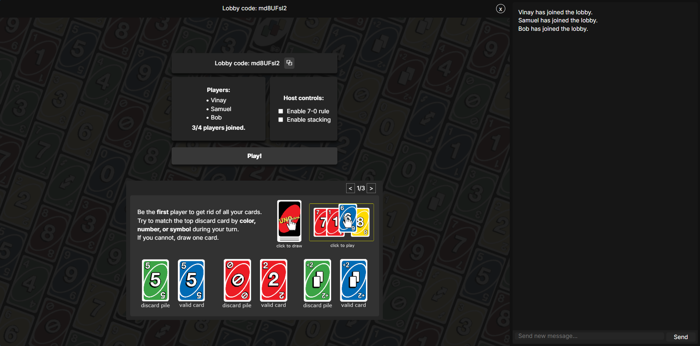
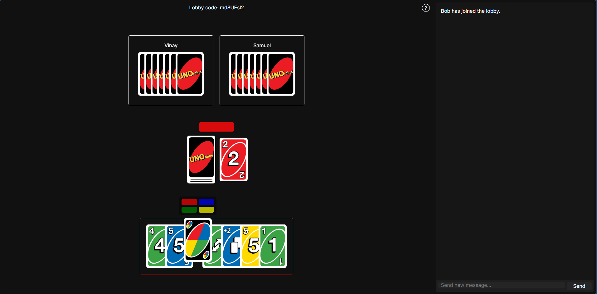
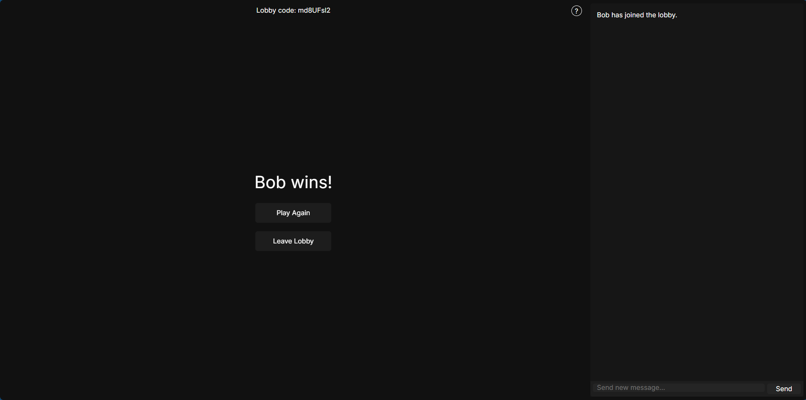

UNOnline is a primitive multiplayer implementation of UNO using Python Websockets and HTML/Javascript/CSS.



##Features

- Multiplayer lobby system
- Real-time chat
- Host controls
- Optional house rules (7-0 and stacking)
- Interactive help pages

##How do I run it locally?

Clone the repository

```bash
git clone https://github.com/PAjaiy/UNOnline.git
```

Install dependencies

```bash
pip install -r requirements.txt
```

Run the server
```bash
python server.py
```

Serve the frontend
```bash
python -m http.server 8000
```

Open
```
http://localhost:8000
```

##Screenshots


